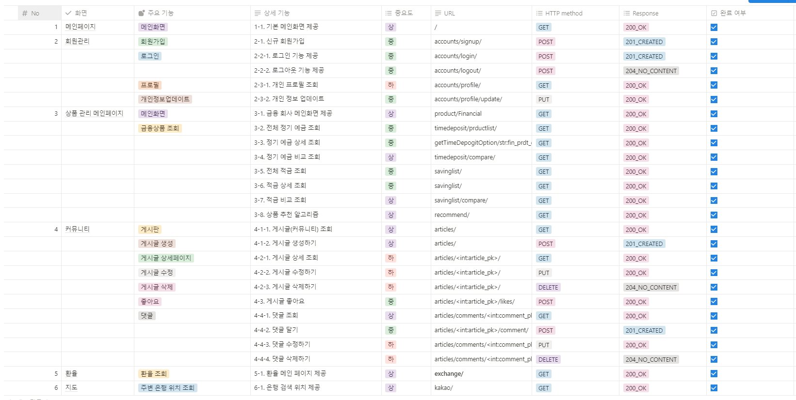

# 프로젝트 - FIFI

## 1. 팀원 정보 및 업무 분담
- 프로젝트 기간 : 24.05.15 ~ 24.05.24

|이름|역할 및 구현 기능|
|---|---|
| 박준영 | ERD, Gantt Chart, 기능 명세서, API 명세서, 홈 화면, 상품 조회(예금, 적금), 상품 비교, 환율계산기, 회원가입, 로그인, 로그아웃, Info Architecture, 상품 추천 알고리즘 |
| 박선민 | ERD, 와이어 프레임(Figma), 기능명세서, API 명세서, 커뮤니티(게시글, 댓글, 좋아요), 지도 검색, 프로필 |

## 2. 기능명세서
   

## 3. API 명세서
   

## 4. Info Architecture

## 5. ERD
   

## 5. 와이어프레임   
   

## 6. 페이지 별 기능 설명
  1. 메인페이지
  - 홈페이지에 각 테마별로 기능들에 접근할 수 있도록 테마를 꾸몄습니다.
  - 회원가입 및 로그인, 상품 조회, 환전 조회, 커뮤니티, 지도 검색   
     
  

  2. 회원가입 및 로그인 페이지
  - 회원가입과 로그인 시 틀린 정보가 기입될 시 오류 메세지를 띄울 수 있도록 기능 구현하였습니다.   
     
  
  
   
  3. 프로필 페이지
  - 프로필 화면은 연봉을 기입 시 상품 추천 알고리즘을 이용할 수 있도록 구현하였습니다.
  - 토글 버튼을 클릭하면 내가 좋아요한 게시글을 띄우고 클릭 시 바로 이동할 수 있도록 구현하였습니다.
     
  
  
   
  4. 상품조회 페이지
  - 상품 조회 페이지는 금융회사 정보, 정기예금 정보, 상품 비교를 확인할 수 있도록 구현하였습니다.
  - 금융 회사 정보는 각 금융사 별로 좋아요 버튼 기능 구현과, 홈페이지 이동, 콜센터 전화번호를 확인할 수 있도록 구현하였습니다.
  - 정기예금 정보는 전체 상품들에 대한 정보와 상품 선택 시 상품 가입을 할 수 있는 디테일 페이지를 구현하였습니다.
  - 상품 비교 페이지는 최대 4개까지 상품을 비교하여 각 상품별로 차이점을 알 수 있도록 모달창으로 기능 구현하였습니다.   
   
   
   
   
   
      
  5. 상품 추천 알고리즘
  - 각 상품에 대한 가중치를 계산한 후 추천 받을 금융 상품에 대한 목록을 산출하여 유저에게 제공하는 기능을 구현하였습니다.
  - 세부 내용은 7번 알고리즘 기술설명에 기재
     
  

  6. 환율 계산기
  - 각 통화에 맞게 환전 계산기를 구현하였습니다.
  - 총 23개 국가에 대한 환율 변환이 가능하며 우측은 원화를 기준으로 데이터를 산출하는 그래프를 구현하였습니다.
     
  

  7. 커뮤니티 페이지
  - 커뮤니티 페이지는 최신순, 트렌드순(좋아요), 내가 쓴글 기준으로 정렬할 수 있도록 구현하였습니다.
  - 각 게시글 디테일은 댓글 기능, 좋아요 기능을 구현하였습니다.
     
  
  

  8. 지도 검색
  - 지도 검색 페이지는 우리 은행, 신한 은행, 하나 은행 중 하나를 선택 후 지역명을 작성 시 해당 지역의 선택한 은행이 나타나도록 기능 구현하였습니다.
     
  

## 7. 알고리즘 기술적 설명 (추천 알고리즘)
- 추천 알고리즘

유저의 더미데이터를 이용하여 나이, 연봉, 선호도, 상품가입유저수 를 기반으로 비중치를 계산하여 총 합산을 기준으로 상품을 추천해주는 알고리즘 입니다.

나이, 연봉, 선호도, 상품가입유저수는 각 25%, 35%, 20%, 20% 의 비중을 가집니다.
계산의 신뢰성을 더하기 위해 Null 값인 Data는 제외되며, 각 종류 별 하기와 같은 방법으로 측정됩니다.

1. 나이 : 유저와 타 유저의 나이 비율을 계산하여 20 / 50 / 75 / 100 기준으로 0 / 0.25 / 0.5 / 0.75 / 1 의 가중치를 가집니다.
2. 연봉 : 유저와 타 유저의 연봉 비율을 계산하여 20 / 50 / 75 / 100 기준으로 1 / 0.75 / 0.5 / 0.25 의 가중치를 가집니다.
3. 회사선호도 : 해당 상품의 회사 선호도와 전체 회사의 선호도의 비율을 계산하여 20 / 50 / 75/ 100 기준으로 0 / 0.25 / 0.5 / 0.75 / 1 의 가중치를 가집니다.
4. 가입유저수 : 유저가 가입한 상품들을 기준으로 비율을 계산하여 20 / 50 / 75 / 100 기준으로 0/ 0.25 / 0.5 / 0.75 / 1 의 가중치를 가집니다.

>> 각 가중치에 비중(%)를 곱하고 각 요소의 합을 기준으로 상품을 추천합니다.

## 8. Project Gantt Chart

## 9. 느낀점 후기

- 박준영 : 경험만큼 교육적인 것은 없다 -Jean-Jacques Rousseau 
개발자가 취업할 때 면접에서 필수적으로 질문 받는 것이 프로젝트 경험인데, 그 이유를 이번 프로젝트를 통해서 배웠습니다.
강의와 책에서 보던 내용보다 실제로 적용하면서 경험했던 시간이 더 값진 시간으로 느껴졌습니다. 개발 기간은 짧았고, 처음 해보는 프로젝트라 많이 서툴렀지만 이 경험을 기반으로 다음 에는 더 괜찮은 결과물을 낼 수 있을 것 같습니다.

- 박선민 : 처음에는 어떻게 시작해야 할지 막막하기만 했던것이 그래도 같이 하나씩 하다보니 완성되어가는 것이 신기했다. 실습만 했을때는 감이 잘 오지 않던게 직접 오류를 수정해가면서 코드를 작성하다보니 이제 어느정도는 알것 같다 실직적인 개발 기간은 2주 정도여서 정말 촉박하고 바빴지만 그래도 만족스러운 결과물이 나온 것 같다(박준영 덕분...ㅎ) 이번 프로젝트로 많이 성장한 것 같았고 다음에는 더 잘하고 싶다는 욕심이 생겼다 

